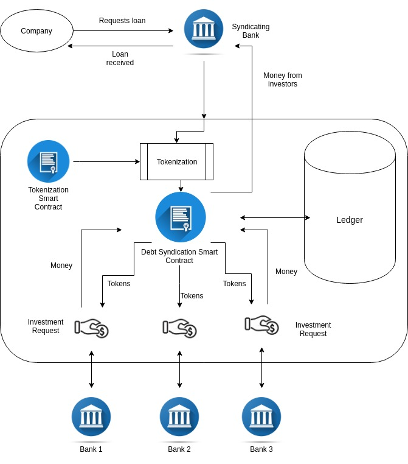

# Syndicate

Simplifying Huge Loan Process and Reducing Risk

## Introduction
When a borrower requires a sum of money that is too large to be provided by a single lender, or outside the scope of the lender’s risk-exposure level, funds are agglomerated from a number of lenders in a process termed as debt syndication.

The Need for Debt Syndication in India

A number of businesses in the Indian market today could use additional financing solutions for the financial leverage required to scale operations and grow. For a long time, firms in the Indian market have suffered from a lack of options in financing solutions since the debt market in India was less developed than the equity market. Although the equity route is a viable one for raising funds, it provides the investor with a claim to the business and dilutes the ownership interest of the founders. For this reason, many company owners choose to retain their claim to ownership of the business and restrain themselves from seeking equity funds.

In recent times, however, debt syndication in India has helped bridge the gap between equity markets and debt markets in India. The growth in the availability of syndicated loans means that owners have alternative methods to raise funds for their companies without having to dilute their ownership. In the future, the availability of these loans is only expected to rise based on the trends of other countries like Japan, Korea, and the USA who have developed debt markets.
Debt Remittance is currently a cumbersome process that requires days to validate and verify transactions amongst the involved parties. Our platform solves issues in the present day debt syndication process by using a hybrid blockchain network. It has following advantages: Faster  Liquidity , Secure Anonymity, Improved efficiency and trust. Smart contract driven approach. It also has a smart auction support for the lender if the borrower goes defaulter.   

## Features:

* Transparency
* Faster Liquidity
* Process huge loans
* Reduced risks and damages to banks by defaulter
* Transaction Efficiency
* Real-time Transactions and ledger

## Tech-Stack and Tools:

* Solidity
* Ethereum Blockchain
* Matic formerly Polygon
* Remix IDE
* HTML, CSS, Javascript, jQuery
* 
## Video Explanation
https://youtu.be/BvssqTZGhrg

## Further Details
https://polygon.technology

